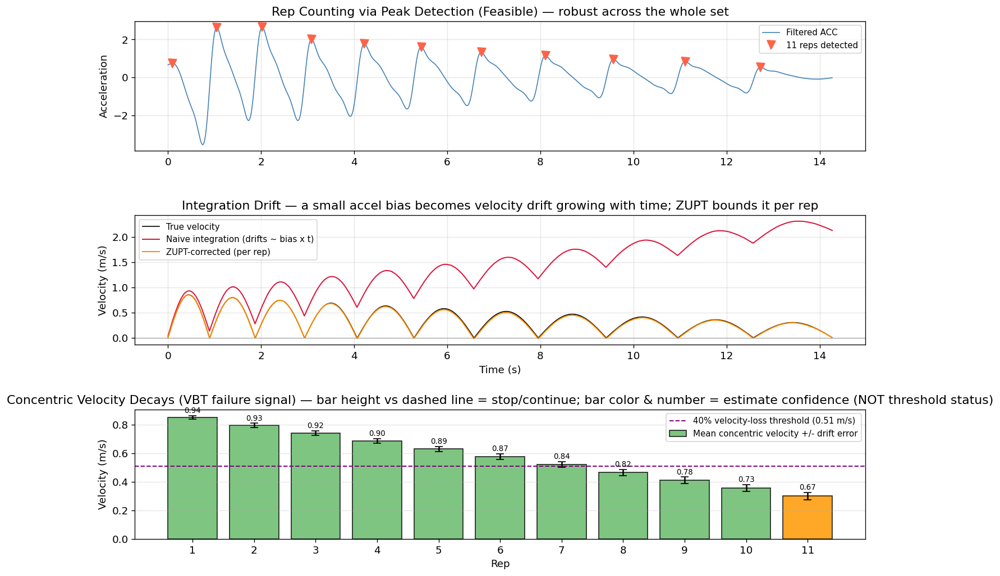
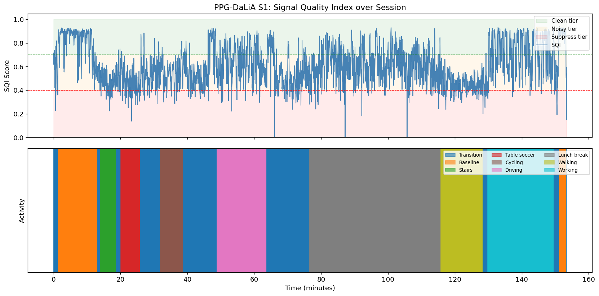
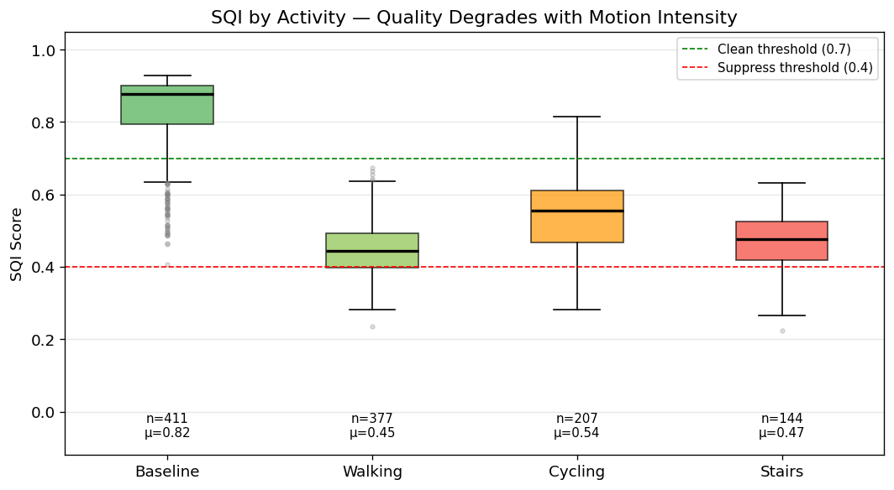
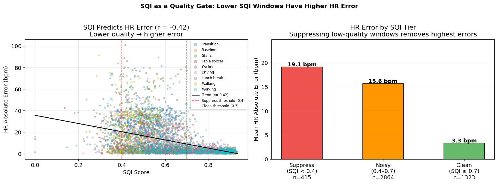

# Fort Take-Home Assessment
**Luke Engel** — Founding Machine Learning Engineer, Health Algorithms

A companion notebook (`sqi_demo.ipynb`) demonstrates the Q3 SQI pipeline on real PPG data (PPG-DaLiA dataset) and the Q2 rep counting / velocity-drift examples on synthetic IMU data. Setup instructions at the bottom.

---

## Q1: Lab to Field — Data, Product, and Feedback

**Bottom line:** the dividing line is whether the user can correct a metric. Non-correctable metrics (HR, HRV, recovery) need a higher pre-launch bar because the field never fixes a wrong number; correctable ones (rep counts, exercise labels) can lean on post-launch feedback, as long as the loop accounts for who actually sends it. The cardinal mistake is reading a lab number as a field number.

### The Correctable / Non-Correctable Asymmetry

The most important distinction in this problem is between metrics users can correct and metrics they cannot. A user can tell the app "that was a Romanian deadlift, not a squat" or "I did 9 reps, not 10." They cannot tell it "my heart rate was actually 142, not 158." That single difference decides whether a post-launch feedback loop even exists: the user is the error sensor for a rep count (closed loop), but for heart rate no error signal ever comes back (open loop). It cascades into three different engineering decisions:

| | **Non-correctable** (HR, HRV, recovery) | **Correctable** (reps, labels) |
|---|---|---|
| **Pre-launch bar** | High. No second chance. Validate against reference (ECG), stratify by subgroup, suppress when SQI is low. | Lower. Ship "useful," then improve in the field. |
| **Feedback loop** | No corrections exist, so monitor *proxies*: SQI, motion intensity, and engagement drop-off (a user who stops opening their recovery score is the closest thing to a complaint). | Corrections exist but are biased — confident users correct, frustrated ones churn. Weight and debias them; never train at face value. |
| **"Ready to ship"** | Validated + calibrated confidence + suppression wired up. | Useful enough + correction loop instrumented + debiasing in place. |

---

### Lab → Field: Two Kinds of Shift

The gap between lab validation and field performance has two components that must be treated separately.

**Feature shift:** The signal distribution changes. Lab sessions use controlled placement, motivated subjects, and clean environments; field sessions have inconsistent wear position, varied skin tones, and ambient interference. A PPG heart rate model validated at low single-digit bpm MAE on a treadmill will see substantially higher error during kettlebell swings, not because the architecture is wrong but because the input distribution shifted. Grosicki et al. (2025) frames this well: accuracy claims hold only when measurement context is matched between lab and field. Lab numbers are upper bounds, not field predictions.

**Label shift:** The activity distribution changes too. Lab datasets oversample exercises that are easy to label. Field users do movements outside the training distribution and create ambiguous cases the lab protocol never saw. IMUTube (Kwon et al., 2020) addresses this directly, converting exercise video into virtual IMU data, and is the right approach for bootstrapping long-tail coverage before it arrives in production.

| Phase | What it tests | Reference signal |
|---|---|---|
| Controlled lab | Accuracy under ideal conditions | ECG, LPT, validated reference |
| Structured field | Signal distribution shift, wear variation | Per-segment error by activity |
| Open field beta | Label shift, user behavior, edge cases | Error by subgroup |
| Production | Drift, population shift, demographic gaps | Continuous proxy monitoring |

Each phase should use user-held-out evaluation: never evaluate on subjects who appear in training. It's the same instinct as family-aware cross-validation in multi-site neuroimaging — block the correlated unit so the split can't leak optimistic accuracy — except here the grouping unit is the user (whose repeat sessions are near-duplicates) rather than the family. A model that generalizes to new users is a harder, more honest test than one that generalizes to new sessions from known users.

---

### Pre-Launch: What I'd Require

- **Accuracy stratified by subgroup**, not aggregate: skin tone, motion intensity tier, activity type, wear fit. Aggregate accuracy that hides per-subgroup failure will surface as a bias problem post-launch.
- **Demographic coverage.** Wrist PPG leans on green light and melanin absorbs in that band, so darker skin returns a weaker optical signal — physically, a lower-SNR starting point. For *heart rate* the evidence is actually mixed: Bent et al. (2020) found motion, not skin tone, dominated wrist-PPG HR error, so I wouldn't overstate the HR case. *SpO₂* is where the bias is unambiguous: pulse oximetry *overestimates* saturation with more pigmentation, which is how occult hypoxemia gets missed (Sjoding et al., 2020, NEJM), and a reason consumer SpO₂ generally ships as a wellness feature rather than a cleared medical device. If our validation set skews light-skinned, headline accuracy is an average that hides a failure splitting along skin tone. So I'd gate on per-skin-tone error, not pooled; if we can't recruit the coverage in time, I'd suppress SpO₂ over the affected range rather than ship a number I already know is biased.
- **Per-segment error, not session-level.** The session average is the number that lets a bad model look fine: 2 bpm MAE over 30 minutes can hide being 20 bpm off during the high-intensity windows users actually care about. I'd report error windowed by motion tier and treat the session mean as a summary, never the acceptance bar.
- **Synthetic stress testing.** Before users find the failure boundary, I'd find it myself: inject known artifacts, poor wear fit, and signal dropout at controlled levels and watch where accuracy breaks. The point isn't passing the clean case; it's knowing the SNR at which the algorithm stops working, so suppression can be set there deliberately rather than discovered in the field.
- **Cold start policy**: Don't show recovery or HRV-derived scores in the first two weeks. The Bayesian framing is right: show population-informed priors early, and contract toward individual baseline as data accumulates. A personalized score before a baseline exists just trains distrust, at the moment users are deciding whether to keep the product.

---

### Post-Launch: What I'd Monitor

- **Error proxy signals.** Ground truth disappears the moment we leave the lab, so I'd monitor what correlates with error instead: motion intensity at measurement time, the SQI distribution, wear-compliance flags, dropout rates by demographic segment. None is error itself, but a shift in any of them is the earliest warning that error is climbing somewhere we can't directly see.
- **Correction rate, stratified, not pooled.** A flat correction rate tells me almost nothing; the signal is in the strata. Broken down by exercise type, user tier, and confidence *at prediction time*, a spike confined to one slice (corrections clustered on high-confidence machine-exercise predictions, say) points straight at a specific failure mode rather than generic noise.
- **Engagement drop-off on non-correctable metrics.** This is the closest thing to a complaint for metrics users can't correct: someone who quietly stops opening their recovery score has stopped believing it. I'd correlate that disengagement with the value ranges and subgroups it clusters in, and treat a cluster as a quality signal, not a retention problem to fix with notifications.
- **Distribution drift detection**: Monitor input feature distributions over time. If the user population shifts, retrain and revalidate.
- **Second-order metric tracking**: Post-launch data enables metrics that are impossible to design pre-launch. Day-to-day stability of HRV (its coefficient of variation across days) carries fatigue signal that single readings miss, but you can only build it once you have a population's worth of longitudinal data.

---

### What to Avoid Over-Trusting

**Proprietary composite scores.** A recovery or readiness number folds several noisy estimates (HRV, RHR, sleep) through an opaque weighting, which can be harder to validate than any single signal feeding it: the errors don't necessarily cancel, and there's no external criterion to check against. I'd want anything we ship as a composite validated against something outside the device, not just published with a plausible formula.

**User corrections as ground truth.** Tempting, since corrections are free labels, but they come from a self-selected sample: confident users correct, frustrated ones churn without a word. The stream is skewed toward the errors engaged users notice, not the errors the model actually makes. Use them as a weighted signal, never a training target at face value.

---

### Where I'd put the line

The mistake I'd most want to avoid is reading a lab number as a field number. For a correctable metric the field repairs it; for a non-correctable one you never find out — the user just quietly stops trusting the product, and that's the hardest trust to win back.

---

## Q2: Sensor First Principles — Feasibility, Observability, and Product Behavior

**Bottom line:** before asking "can we model this," ask whether the information is even in the signal. Sort each metric into feasible / hard-but-learnable / not-observable — that decides whether you build it, build it with a confidence score, or add a sensor or ask the user. Absolute load is a physics limit (F = ma); proximity-to-failure via velocity decay is the high-value learnable problem, with confidence that degrades right where it matters most.

### The Right Question to Ask First

Before asking "can we build a model for this," ask: *is the information present in the signal at all?* If the physics of the measurement prevents the signal from encoding the quantity you want, no architecture or dataset size recovers it. The first job is separating problems where modeling is the bottleneck from problems where physics is, because those require completely different responses.

---

### A Three-Tier Framework

| Tier | Definition | Engineering response |
|---|---|---|
| **Feasible** | Information clearly present and discriminable | Build and validate |
| **Hard but learnable** | Information present but entangled with confounders | Invest, confidence-score output, communicate uncertainty |
| **Not observable** | Information not in the signal — physics prevents it | Add a sensor, ask the user, or don't claim the metric |

The boundary between hard-but-learnable and not-observable is where the most consequential product decisions get made, and where it's easiest to fool yourself into building something that looks like it works in the lab but isn't measuring what you think.

---

### Walking Fort's Problem Space

**Feasible**

Large compound movements are feasible from wrist IMU. A squat, deadlift, bench press, and pull-up each produce characteristic periodic waveforms: different dominant axes, frequency profiles, amplitude envelopes. Recognizing tens of distinct gym movements from wrist/wearable accelerometry is well established (Koskimäki & Siirtola, 2014), and a CNN over sliding windows is a reasonable production approach. Rep counting for these movements follows directly: each rep is a peak in the dominant axis. See `sqi_demo.ipynb` for a working example.

Heart rate at rest and HRV during sleep are feasible from PPG: the cardiac signal at 0.5–4 Hz is well-separated from motion artifact when the user is still, and best-in-class wearables validate very closely against ECG in that regime (HRV is the harder of the two, but still tractable at rest).

**Hard but Learnable**

Distinguishing kinematically similar movements is hard but learnable. A squat and Romanian deadlift share vertical displacement profiles; discrimination requires subtle differences in acceleration phasing, range-of-motion, and tempo. Solvable with more data (IMUTube, Kwon et al., 2020, generates virtual IMU from exercise video) and few-shot generalization for novel movements.

Heart rate during moderate exercise is hard but learnable. IMU provides a motion reference for adaptive filtering (LMS/RLS), and a SQI-gated cascade handles most of the dynamic range. Honest accuracy floor: ~2.3 bpm MAE during fast running (Zhang et al., 2015), degrading as intensity increases.

**Proximity-to-failure via velocity decay is an important hard-but-learnable problem Fort faces.** Bar velocity decays as a set approaches failure. The commonly cited velocity-loss cutoffs (roughly 40% lower body, 50% upper body) are useful rules of thumb, but they're exercise- and population-dependent, not universal constants, so I'd treat any fixed threshold as a starting prior to calibrate per user. The harder problem: IMU velocity comes from integrating acceleration, and a small accelerometer bias integrates into drift that grows with time. Drift accumulates over time regardless of how fast the lifter moves; what's worst near failure is the *relative* error, because true velocity is small and reps are long, so the same absolute drift swamps a smaller signal. That's the tension: the near-failure regime is where the VBT signal matters most and where the estimate is least reliable. The notebook shows it concretely: a constant bias, per-rep ZUPT, and confidence driven by relative drift error rather than raw speed.

**Not Observable from Current Configuration**

"Not observable" is always relative to a sensor setup, not an absolute verdict. Each item below names why the information is absent today and what changes the tier.

Absolute external load cannot be derived from kinematics alone. F = ma: the IMU measures acceleration, not mass or force, so the same motion is consistent with many load-and-force combinations — a given bar velocity can come from a heavy weight near 1RM or a lighter weight moved with deliberate control, and kinematics alone can't separate them. No modeling path exists around this; it's a physics constraint. The response is to ask the user to log the weight and build a per-user force-velocity profile over time, which combined with velocity-decay curves gives a proxy for relative load and proximity to 1RM without direct force measurement. That division of labor is the product, not a gap in it: the user supplies the one quantity physics rules out (mass), and the sensor supplies what a lifter can't feel for themselves — per-rep velocity, decay rate, and proximity to failure. That observable effort layer is also the differentiator: a passive-physiology wearable built for sleep and recovery doesn't measure it, and a wrist watch can't reach the seated-machine movements the case mount instruments.

Lower-body machine exercises (leg press, leg extension, seated cable rows) aren't observable from the wrist: the user is seated and stabilized, so there's no kinematic coupling. This is a placement problem, not a learning problem. Fort's magnetic case mount on the machine carriage solves it directly, moving these from not-observable to feasible, which is why the form-factor decision is architecturally correct, not just ergonomic.

Heart rate during extreme high-intensity motion has a hard accuracy floor: when motion artifact amplitude exceeds the cardiac signal, no filtering recovers the pulse cleanly. Suppress, and resume when quality recovers. The boundary is hardware-dependent, though: a non-optical modality like mmWave radar sidesteps optical motion artifact entirely and may shift this tier within a few hardware generations.

SpO₂ from consumer PPG sits at the boundary for medical-grade claims. At rest with good contact it works; under motion, on darker skin, or below 90% saturation, accuracy degrades enough that clinical claims are inappropriate. Treat it as a resting/sleep metric with explicit suppression during activity. The path forward is hardware: narrower-bandwidth and multi-wavelength sensing (4+ wavelengths vs. the standard 2), which a 2025 review discusses among the hardware mitigations for melanin-induced bias (Bradley et al., 2025). That could move SpO₂ into hard-but-learnable within two to three hardware generations.

---


*Top: rep counting via peak detection: all 11 reps found across the full set. Middle: velocity via integration, where a constant 0.015 g accelerometer bias makes the naive estimate drift away (red), while per-rep ZUPT keeps the corrected estimate (orange) tracking truth (black). Bottom: per-rep concentric velocity decays past the 40% velocity-loss line at rep 8 (the VBT failure signal); error bars are the estimated drift error, which widens near failure, and the numbers are confidence (0.94 → 0.67). The point is that the product should widen error bars on late-set reps, not suppress them: the low velocity is the signal.*

### What this buys us

Working out the observability tier before reaching for a model saves building the wrong thing: feasible → build it; hard-but-learnable → build it but score and communicate confidence; not-observable → add a sensor, ask the user, or don't claim the metric. The trap is treating a physics problem as a modeling problem: no amount of data fixes information that isn't in the signal, and a model pushed hard enough on that gap will happily output a confident number anyway.

---

## Q3: Signal Quality Estimation — Raw Data to Production

**Bottom line:** signal quality estimation is the gate every other metric depends on. Score each window, route it (clean → cheap path, noisy → recover with adaptive filtering, unrecoverable → suppress), and validate the two-parter the design hangs on: when it says clean, is the downstream number accurate, and when it says suppress, was that the right call? The notebook demonstrates this on real PPG data.

### Why This Problem

A heart rate estimate, HRV measurement, recovery score, or proximity-to-failure inference is only as trustworthy as the quality assessment that precedes it. Getting SQI wrong permissively (reporting a confident number from a corrupted signal) is the fastest way to train users not to trust the product. Getting it wrong restrictively (suppressing valid data) produces a wearable that shows nothing during the moments users care most about. This is where the role's core requirement lives: "knowing when the signal is trustworthy, when it is not, and how that uncertainty should affect the product experience."

I picked this over motion-artifact removal deliberately. Adaptive PPG-IMU fusion (using the accelerometer as a noise reference to cancel motion out of the pulse) is a real and useful technique, but it's a *component the gate routes into* when the signal is recoverable, not the gate itself. The harder, more product-defining problem is deciding whether there's signal worth recovering at all: artifact removal only helps when a pulse survives under the noise, and confidently "recovering" a signal that isn't there is exactly the failure SQI exists to prevent.

---

### Problem Framing

**Assumption**: 8-second windows at 64–100 Hz, 50–75% overlap (the notebook uses a 2 s stride = 75% to emit one SQI per 2 s HR label). Long enough to capture multiple cardiac cycles; short enough to respond to motion transitions within a rep.

Assign each window of PPG + IMU data to one of three tiers:

- **Clean** (SQI ≥ 0.7): cardiac signal dominant; standard algorithms apply
- **Noisy** (SQI 0.4–0.7): motion artifact present but cardiac signal recoverable with artifact rejection
- **Unrecoverable** (SQI < 0.4): artifact exceeds signal; downstream metrics suppressed

The SQI output has two consumers with different error costs. The processing pipeline needs to know which computational path to take. The product needs to know whether to display the metric. A false "clean" (showing bad data as good) is more damaging than a false "noisy" (hiding valid data). The loss function reflects this asymmetry.

---

### Data Requirements

The bottleneck is labels. Quality labels require ECG reference (expensive, lab-only) or expert annotation (slow, subjective). Neither scales to the field.

**Stage 1 — algorithmic pseudo-labels.** The way around the label bottleneck is to stop needing ECG for every window. Several SQIs come straight off the PPG waveform (autocorrelation, spectral entropy in the cardiac band, SNR of the dominant peak, perfusion index, peak-to-peak amplitude regularity) with no reference signal. They're noisy but free, and they scale to all the unlabeled field data we have, so I'd use them to generate weak labels at volume; a topology-based self-supervised gate does exactly this and generalizes across devices with no labeled training at all (arXiv 2509.12510, 2025).

**Stage 2 — targeted lab annotation.** The expensive ECG-referenced data I'd spend deliberately, not uniformly. Labeling everything is wasteful when the algorithmic SQIs already agree on the easy windows; the cases worth a clinician's time are the boundary ones where they *disagree*. So I'd collect ECG-referenced sessions across motion tiers and skin tones and annotate only the disagreements, which is where labels actually move the model.

Minimum before I'd ship: 50+ subjects, stratified by skin tone and IMU-verified motion-intensity tier (not 50 convenient subjects, since pooled coverage is exactly what hides the darker-skin failure mode from Q1). The drivers worth covering are motion intensity, skin-sensor coupling, and perfusion (Charlton et al., 2025).

---

### Modeling Approach

The full pipeline is demonstrated in `sqi_demo.ipynb` using the PPG-DaLiA dataset (PPG at 64 Hz + 3-axis ACC at 32 Hz + ECG reference across the dataset's eight daily-life activities plus transitions, 15 subjects). One scoping note: the notebook implements a transparent three-feature heuristic (cardiac peak SNR × autocorrelation × motion penalty) to show those features carry signal and separate the tiers on real data. The production gate would be a *learned* classifier over a richer feature set (a small feature-based XGBoost), trained once the features prove informative. The demo validates the features and the gating logic, not a final shipped model.

**Architecture — SQI-gated processing cascade:**

Every 8-second window of PPG + IMU first hits `compute_sqi()` — deliberately cheap, a handful of time- and frequency-domain features rather than a heavy model, targeting sub-millisecond cost once quantized for the edge — and its score routes the window down one of three paths:

| SQI | Processing path | Cost | Output confidence |
|---|---|---|---|
| ≥ 0.7 | FFT peak HR | Cheap | High |
| 0.4 – 0.7 | Adaptive filter, then FFT peak HR | Moderate | Moderate |
| < 0.4 | Suppress — no HR computed | None | Suppressed |

Compute cost is proportional to signal difficulty: clean windows spend almost nothing; unrecoverable windows pay nothing and show nothing. This directly addresses the power constraint.


*SQI over a full PPG-DaLiA session (Subject S1). Top: SQI score with clean/noisy/suppress tier bands. Bottom: ground-truth activity labels. SQI drops when motion-intensive activities begin and recovers at rest, without any labeled training data.*

For artifact segmentation within a window (labeling which *portions* are corrupted rather than rejecting the whole window), lightweight fully-convolutional segmenters with atrous convolutions (e.g. Tiny-PPG, arXiv 2305.03308, 2023) allow partial-window recovery rather than all-or-nothing suppression.

For edge deployment, the sequence I'd insist on is cloud-validate first, quantize second: prove the algorithm correct at full precision before hardware constraints touch it, so an accuracy regression and a quantization artifact never have to be debugged at once. For the feature-based gate that ships first (a small XGBoost), the tool is plain INT8 quantization of the split thresholds and leaf weights — post-training, since a shallow tree ensemble quantizes cleanly without retraining.

---

### Validation Strategy

Primary: when SQI says "clean," does downstream HR agree with ECG? When SQI says "unrecoverable," is suppression the right call?

- **Per-segment error by SQI tier**: clean windows should have materially lower HR error than suppressed ones. I'd avoid benchmarking against the 2.3 bpm TROIKA figure (Zhang et al., 2015): that used full sparse reconstruction on a controlled running protocol, not the naive FFT-peak estimator the notebook uses across mixed daily-life activities. The honest target is tier separation, not a headline MAE. Unrecoverable windows are excluded from accuracy reporting; suppression is the correct behavior there, not a failure.
- **Calibration**: SQI scores should correlate with actual downstream error. A window scored 0.8 should have lower HR error than one scored 0.5. Miscalibrated confidence is the failure mode that silently ships wrong numbers.
- **Synthetic validation**: Inject known motion artifacts into ECG-referenced PPG at controlled SNR levels and test detection across the range, especially near the clean/noisy and noisy/unrecoverable boundaries. Knowing the ground truth means you can characterize exactly where the boundary classifier fails before users do. This mirrors the synthetic stress-test suite from my thesis.

*SQI distributions by activity (PPG-DaLiA S1). Ordering follows expected motion intensity: baseline cleanest (mean 0.82), walking and stairs lowest (~0.45–0.47). All three features (cardiac peak SNR, autocorrelation, motion penalty) vary across windows and contribute to the score; none is degenerate. (The first version of the SNR feature was: I'd computed in-band power after band-passing to that same band, which is ~0.99 for every window and carried no information. The fixed version measures peak prominence against a wider denominator.)*


*Left: SQI negatively correlates with HR absolute error (r = −0.42): lower quality windows have higher estimation error. Right: mean error by tier, where clean windows (SQI ≥ 0.7) average 3.3 bpm error vs. 19.1 bpm for suppress-tier windows. The gating decision is justified: the windows the product suppresses are precisely the ones with the highest error. Caveat worth naming: the motion feature is derived from ACC and PPG error is also motion-driven, so part of this correlation is "motion predicts motion-corrupted error." It's not a fully independent validation; it's evidence the gate fires where the error actually is.*

- **User-held-out evaluation**: Train on N−1 users, test on the held-out user. Users are sites — the same leakage problem that inflates apparent performance in multi-site neuroimaging studies applies here.
- **Demographic stratification**: Report false-clean rate separately by skin tone. A system well-calibrated in aggregate but showing 3× false-clean rate on darker skin ships a biased product.

---

### Uncertainty Handling

SQI output is a continuous score, not binary. Thresholds determine processing tier, but the score is preserved for downstream use.

| SQI tier | Display behavior |
|---|---|
| Clean (≥ 0.7) | Show metric, no qualifier |
| Noisy (0.4–0.7) | Show metric with confidence range or "~" prefix |
| Unrecoverable (< 0.4) | Do not show; surface reason ("measuring...") |

Suppression is not a failure state; it's a feature. A product that knows when not to speak is more trustworthy than one that always says something.

During a user's first sessions, the SQI model hasn't calibrated to their personal signal characteristics. Suppress more readily early, relax as per-user calibration accumulates.

---

### Failure Modes and Real Constraints

**Noisy labels at scale.** Pseudo-labels are weakest exactly where the model matters most (the clean/noisy and noisy/unrecoverable boundaries), so training on them naively makes the model most confident where it's least informed. I'd counter it on two fronts: spend Stage-2 annotation on the boundary cases, and weight the loss so a confident boundary error costs more than a wrong interior one.

**Distribution shift.** The thing I'd watch in production is the fraction of windows landing in each tier: cheap to compute, and it moves before the metrics do. A creeping rise in the unrecoverable fraction flags either population shift or a firmware change degrading signal quality, and I'd rather catch that from the SQI histogram than from a wave of bad recovery scores.

**Power.** A gate runs on *every* window, including the ones it passes through cheaply, so if the gate itself isn't cheap it eats the savings it's meant to create. That's what picks the model: a small feature-based XGBoost on INT8 weights clears the bar, a heavier classifier wouldn't, and that's the real reason I'm not reaching for a neural net.

**Latency.** Online SQI has to return inside the window stride (~4 s) or the cascade stalls. Time-domain features (autocorrelation, peak regularity) compute faster than spectral ones, so I'd route the first tier on those and reserve spectral features for windows that survive the cheap check.

**Memory.** The gate has to live in the MCU's tight SRAM/flash budget alongside everything else. A small INT8 XGBoost is a few KB of split thresholds and leaf values, no large weight matrices, no DRAM, and the feature extractor needs only a bounded ring buffer for the current 8-second window plus a little running state, so the footprint is fixed and known at compile time. This compounds the power argument for a tree over a neural net: it's not just cheap to run, it's cheap to *store*.

**Suppression creep.** The failure mode I'd worry about most, because it looks like success: tune toward precision, the false-clean rate drops, the dashboards look great, and the product quietly shows nothing during half the workout. So I'd track suppression rate as a first-class product metric: cross ~25% of active workout time and the thresholds get re-examined.

---

### How I'd build it

SQI is load-bearing because every other metric depends on it. The path: self-supervised bootstrapping on unlabeled field data, calibration against ECG-referenced lab sessions, an SQI-gated cascade that spends compute proportional to signal difficulty, and a continuous quality score driving suppress/show with loss weighting that punishes false-clean harder than false-noisy. The validation question isn't "does the SQI look reasonable." It's the two-parter the design hangs on: when it says clean, is the downstream number actually accurate, and when it says unrecoverable, was suppression the right call?

---

## Setup

```bash
# 1. Clone
git clone https://github.com/lukeengel/fort-assessment
cd fort-assessment

# 2. Create environment
conda env create -f environment.yml
conda activate fort

# 3. Get the dataset
#    Download PPG-DaLiA from:
#    https://archive.ics.uci.edu/dataset/495/ppg+dalia
#    Unzip into data/ — you should have data/PPG_FieldStudy/S1.pkl … S15.pkl

# 4. Run the notebook
jupyter notebook sqi_demo.ipynb
```

## References

- Grosicki et al. (2025). Accurate comparison of wearables requires contextual equivalence. *Physiological Reports.* [Link](https://pmc.ncbi.nlm.nih.gov/articles/PMC12701519/)
- Kwon et al. (2020). IMUTube: Automatic extraction of virtual on-body accelerometry from video for human activity recognition. *Proc. ACM IMWUT, 4(3).* [Link](https://dl.acm.org/doi/10.1145/3411841)
- Zhang et al. (2015). TROIKA: A general framework for heart rate monitoring using wrist-type PPG signals. *IEEE TBME.* [Link](https://arxiv.org/pdf/1409.5181)
- Reiss et al. (2019). Deep PPG: Large-scale heart rate estimation with convolutional neural networks (PPG-DaLiA dataset). *Sensors, 19(14).* *[UCI ML Repository, id=495.](https://archive.ics.uci.edu/dataset/495/ppg+dalia)*
- Charlton et al. (2025). Determinants of photoplethysmography signal quality at the wrist. *PLOS Digital Health.* [Link](https://journals.plos.org/digitalhealth/article?id=10.1371/journal.pdig.0000585)
- Koskimäki & Siirtola (2014). Recognizing gym exercises using acceleration data from wearable sensors. *IEEE SSCI / CIDM.*
- Bent et al. (2020). Investigating sources of inaccuracy in wearable optical heart rate sensors. *npj Digital Medicine, 3:18.* [Link](https://www.nature.com/articles/s41746-020-0226-6)
- Sjoding et al. (2020). Racial bias in pulse oximetry measurement. *New England Journal of Medicine, 383.* [Link](https://www.nejm.org/doi/full/10.1056/NEJMc2029240)
- arXiv 2509.12510 (2025). Self-supervised and topological signal-quality assessment for any PPG device. [Link](https://arxiv.org/pdf/2509.12510)
- arXiv 2305.03308 (2023). Tiny-PPG: A lightweight deep neural network for real-time detection of motion artifacts in photoplethysmogram signals on edge devices. *Internet of Things.* [Link](https://arxiv.org/abs/2305.03308)
- Bradley et al. (2025). Mitigating melanin-induced bias in pulse oximetry: optical, algorithmic, engineering, hardware and modeling tools. *Sensing and Bio-Sensing Research.* [Link](https://www.sciencedirect.com/science/article/pii/S2214180425001424)
